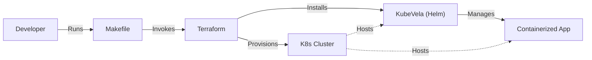

# Helm4GenAI

Helm4GenAI is a boilerplate project designed to simplify the deployment of Generative AI applications using Helm and KubeVela on Kubernetes. It provides a structured foundation for spinning up local clusters and deploying applications.

## Prerequisites

- **Terraform**
- **Helm**
- **Kind**
- **Podman**

### Installation Guide

#### macOS (via Homebrew)
```bash
brew tap hashicorp/tap
brew install hashicorp/tap/terraform helm kind podman
```

## Quick Start
The project includes a `Makefile` to automate the infrastructure setup and application deployment.

### ⚡️ Super Quick Start
To set up, deploy, and expose the app in one command:
```bash
make minimal
```
Then open [http://localhost:8000](http://localhost:8000).

### Manual Steps

### 1. Initialize Infrastructure
To provision the local Kubernetes cluster (Kind) and install KubeVela:

```bash
make up
```

### 2. Deploy Example Application
To deploy the minimal example application:

```bash
make deploy-minimal
```

### 3. Verification
You can verify the components using the following commands:

```bash
make verify-cluster  # Check Kind cluster status
make verify-vela     # Check KubeVela installation
make verify-app      # Check application status
```

### 4. Access Application
To access the application locally:

```bash
make forward
```
Then open [http://localhost:8000](http://localhost:8000) in your browser.

### 5. Cleanup
To destroy the cluster and resources:

```bash
make down
```

## Architecture

The project follows a flow where the Developer uses the Makefile to orchestrate Terraform, which in turn provisions the K8s cluster and installs KubeVela via Helm.



## Project Structure

This project uses a modular Terraform architecture to separate local development from production configurations:

- **`terraform/modules/platform`**: Contains the core logic (KubeVela installation) shared across environments.
- **`terraform/environments/local`**: Configuration for running locally with Kind.
- **`terraform/environments/prod`**: (Skeleton) Configuration for a production cloud environment.

## Troubleshooting

### Podman
If you are using Podman, the `Makefile` automatically sets `KIND_EXPERIMENTAL_PROVIDER=podman` for Terraform commands. Ensure you have initialized and started your podman machine (`podman machine init`, `podman machine start`).
