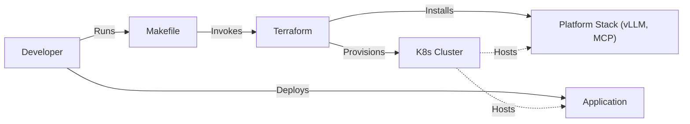

# Helm4GenAI

Helm4GenAI is a boilerplate project designed to simplify the deployment of Generative AI applications on Kubernetes. It provides a structured foundation for spinning up local clusters (Kind) or deploying to production (GKE/Terraform), managing the GenAI stack (vLLM, MCP), and deploying applications using standard Kubernetes manifests.

## Prerequisites

- **Terraform**
- **Helm**
- **Kind**
- **Podman**
- **Google Cloud SDK (`gcloud`)**

### Installation Guide

#### macOS (via Homebrew)
```bash
brew tap hashicorp/tap
brew install hashicorp/tap/terraform helm kind podman
```

## Quick Start
The project includes a `Makefile` to automate the infrastructure setup and application deployment.

### ⚡️ Super Quick Start
To set up, deploy, and expose the app in one command:
```bash
make minimal
```
Then open [http://localhost:8000](http://localhost:8000).

To deploy the GenAI stack (vLLM, Langfuse, MCP) and the **Robots Agent**:
```bash
make robots
```
Then open [http://localhost:7860](http://localhost:7860).

### Manual Steps

### 1. Initialize Infrastructure
To provision the local Kubernetes cluster (Kind) and install the platform stack (vLLM, MCP):

```bash
make up
```

### 2. Deploy Example Application
To deploy the minimal example application:

```bash
make deploy APP=minimal
```

To deploy the **Robots Agent** (GenAI Example):

```bash
make deploy APP=robots
```

### 3. Verification
You can verify the components using the following commands:

```bash
make verify-cluster       # Check Kind cluster status
make verify-app APP=minimal # Check minimal app status
make verify-app APP=robots  # Check robots app status
```

### 4. Access Application
To access the minimal application locally:

```bash
make serve APP=minimal
```
Then open [http://localhost:8000](http://localhost:8000).

To access the **Robots Agent**:

```bash
make serve APP=robots
```
Then open [http://localhost:7860](http://localhost:7860).


> [!TIP]
> The `serve-*` commands (app, robots, langfuse) will block your terminal. Open a **new terminal tab or window** to run `make langfuse` while your application is running in another.

### 5. Cleanup
To destroy the cluster and resources:

```bash
make down
```

### 6. Monitoring & Debugging
The Makefile provides several helpers to check the status of your cluster and applications:

```bash
make status                   # Overview of Nodes, Pods, Services, and Helm releases
make watch                    # Watch pods in real-time
make events                   # Show recent cluster events
make logs APP=robots          # Follow logs for a specific app
make describe APP=robots      # Describe pods for troubleshooting
make debug-pod                # Launch an ephemeral pod with network tools (curl, dig, etc.)
```

## Architecture

The project follows a flow where the Developer uses the Makefile to orchestrate Terraform, which in turn provisions the K8s cluster and installs KubeVela via Helm.



## Project Structure

This project uses a modular Terraform architecture to separate local development from production configurations:

- **`terraform/modules/platform`**: Contains the core logic (Platform stack) shared across environments.
- **`terraform/environments/local`**: Configuration for running locally with Kind.
- **`terraform/environments/prod`**: (Skeleton) Configuration for a production cloud environment.


## GCP Deployment Guide

This guide details the steps to deploy the solution to Google Cloud Platform (GKE).

### 1. Prerequisites
Ensure you have the Google Cloud SDK installed and authenticated:
```bash
# Verify installation
gcloud --version

# Login to Google Cloud
gcloud auth login
gcloud auth application-default login

# Install auth plugin for kubectl
gcloud components install gke-gcloud-auth-plugin
```

### 2. Project Setup
1.  Create or select a Google Cloud Project.
2.  Enable the following APIs:
    *   Compute Engine API
    *   Kubernetes Engine API
    *   Artifact Registry API

```bash
gcloud services enable compute.googleapis.com container.googleapis.com artifactregistry.googleapis.com --project your-gcp-project-id
```


To validate the production configuration:
```bash
cd terraform/environments/prod
terraform init
terraform validate
```

### 3. Infrastructure Provisioning (Terraform)
Navigate to the production environment directory and initialize Terraform:

```bash
cd terraform/environments/prod
terraform init
```

Create a `terraform.tfvars` file with your specific configuration (Project ID, Region, etc.):

```hcl
project_id = "your-gcp-project-id"
region     = "us-central1"
zone       = "us-central1-a"
# Add other required variables
```

Apply the configuration to create the GKE cluster:

```bash
terraform apply
```

### 4. Deploy Application
After Terraform completes, configure `kubectl` to connect to your new GKE cluster:

```bash
gcloud container clusters get-credentials helm4genai-prod --region us-central1 --project your-gcp-project-id
```

Deploy the Robots application:

```bash
# Ensure you are in the root directory
cd ../../..
make deploy APP=robots
```

**Note**: For production, you will likely need to build and push container images to Google Artifact Registry (GAR) instead of loading them into Kind. The current `make build-images` target is optimized for local Kind development.

### 5. Verification
Check the status of your GKE nodes and pods:

```bash
kubectl get nodes
kubectl get pods -n genai
```

### 6. Cleanup
To destroy the GCP resources (and avoid costs):

```bash
make down-prod
```

## Troubleshooting

### Podman
If you are using Podman, the `Makefile` automatically sets `KIND_EXPERIMENTAL_PROVIDER=podman` for Terraform commands. Ensure you have initialized and started your podman machine (`podman machine init`, `podman machine start`).
