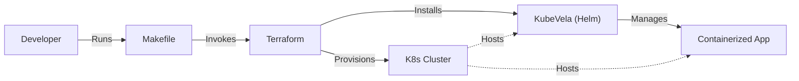

# Helm4GenAI

Helm4GenAI is a boilerplate project designed to simplify the deployment of Generative AI applications using Helm and KubeVela on Kubernetes. It provides a structured foundation for spinning up local clusters and deploying applications.

## Prerequisites

- **Terraform**
- **Helm**
- **Kind**
- **Podman**

### Installation Guide

#### macOS (via Homebrew)
```bash
brew tap hashicorp/tap
brew install hashicorp/tap/terraform helm kind podman
```

## Quick Start
The project includes a `Makefile` to automate the infrastructure setup and application deployment.

### ⚡️ Super Quick Start
To set up, deploy, and expose the app in one command:
```bash
make minimal
```
Then open [http://localhost:8000](http://localhost:8000).

To deploy the GenAI stack (vLLM, Langfuse, MCP) and the **Robots Agent**:
```bash
make robots
```
Then open [http://localhost:7860](http://localhost:7860).

### Manual Steps

### 1. Initialize Infrastructure
To provision the local Kubernetes cluster (Kind) and install KubeVela (plus vLLM, Langfuse, MCP):

```bash
make up
```

### 2. Deploy Example Application
To deploy the minimal example application:

```bash
make deploy APP=minimal
```

To deploy the **Robots Agent** (GenAI Example):

```bash
make deploy APP=robots
```

### 3. Verification
You can verify the components using the following commands:

```bash
make verify-cluster       # Check Kind cluster status
make verify-vela          # Check KubeVela installation
make verify-app APP=minimal # Check minimal app status
make verify-app APP=robots  # Check robots app status
```

### 4. Access Application
To access the minimal application locally:

```bash
make serve APP=minimal
```
Then open [http://localhost:8000](http://localhost:8000).

To access the **Robots Agent**:

```bash
make serve APP=robots
```
Then open [http://localhost:7860](http://localhost:7860).

### Monitor via Langfuse
To access the Langfuse dashboard:
```bash
make serve-langfuse
```
Then open [http://localhost:3000](http://localhost:3000).
Default credentials (if unchanged): `admin` / `admin`.

> [!TIP]
> The `serve-*` commands (app, robots, langfuse) will block your terminal. Open a **new terminal tab or window** to run `make serve-langfuse` while your application is running in another.

### 5. Cleanup
To destroy the cluster and resources:

```bash
make down
```

## Architecture

The project follows a flow where the Developer uses the Makefile to orchestrate Terraform, which in turn provisions the K8s cluster and installs KubeVela via Helm.



## Project Structure

This project uses a modular Terraform architecture to separate local development from production configurations:

- **`terraform/modules/platform`**: Contains the core logic (KubeVela installation) shared across environments.
- **`terraform/environments/local`**: Configuration for running locally with Kind.
- **`terraform/environments/prod`**: (Skeleton) Configuration for a production cloud environment.

## Production Configuration

For production deployments (using `terraform/environments/prod`), you must provide sensitive configuration values.

### Required Variables
- `langfuse_nextauth_url`: The public URL for Langfuse (e.g., `https://langfuse.yourdoman.com`).
- `langfuse_nextauth_secret`: A secure random string for NextAuth.
- `langfuse_salt`: A secure random string for encryption.
- `langfuse_db_password`: Password for the Postgres/Clickhouse database.

### Setting Variables
Create a `prod.tfvars` file or use environment variables:

```hcl
# prod.tfvars
langfuse_nextauth_url    = "https://langfuse.example.com"
langfuse_nextauth_secret = "your-secure-secret"
langfuse_salt            = "your-secure-salt"
langfuse_db_password     = "your-secure-db-password"
```

To validate the production configuration:
```bash
cd terraform/environments/prod
terraform init
terraform validate
```

## Troubleshooting

### Podman
If you are using Podman, the `Makefile` automatically sets `KIND_EXPERIMENTAL_PROVIDER=podman` for Terraform commands. Ensure you have initialized and started your podman machine (`podman machine init`, `podman machine start`).
