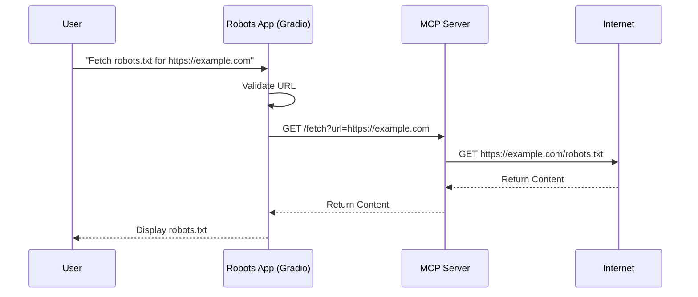

# Robots Agent Example

This example demonstrates a foundational GenAI agent architecture using the **Model Context Protocol (MCP)** pattern.
While currently implemented as a deterministic "Robots.txt Fetcher", it establishes the core communication patterns required for complex LLM-driven agents.

## 🤖 The "Chat Bot" Workflow

Although the current interface isn't a conversational chat (yet), it embodies the **"Tool Use"** pattern central to modern Chat Bots:

1.  **User Intent**: The user wants to retrieve info from a website (specifically `robots.txt`).
2.  **Agent Logic (The App)**: Instead of the LLM hallucinating the content, the "Agent" delegates the task to a specific tool.
3.  **Tool Execution (MCP Server)**: The MCP Server acts as the tool provider, executing the actual HTTP request safely server-side.
4.  **Response**: The real-world data is returned to the user (or in a future step, to the LLM for summarization).



## Components

### 1. Robots App (Frontend Agent)
-   **Stack**: Python, Gradio.
-   **Role**: Acts as the user interface and the "Agent" controller.
-   **Logic**: It validates user input and understands *which* MCP tool to call to fulfill the request.
-   **Future Evolution**: In a full GenAI context, this component would include an LLM (like Llama 3 running on vLLM) that decides dynamically which tool to call based on natural language input.

### 2. MCP Server (Backend Tool)
-   **Stack**: Python, `http.server` (Standard Library).
-   **Role**: Provides specific capabilities (Tools) to the Agent.
-   ** Capabilities**:
    -   `/fetch`: A proxy tool ensuring that the Agent can retrieve web content without direct internet access from the browser or the inference engine itself.

### 3. Infrastructure (Helm4GenAI Platform)
-   **vLLM**: (Provisioned but unused in this specific minimal flow) Ready to serve open-source models.
-   **Langfuse**: (Provisioned) For tracing agent steps and tool calls.

## Usage

1.  **Initialize Platform**:
    ```bash
    make up
    ```

2.  **Deploy Agent**:
    ```bash
    make robots
    ```
    *Note: This builds the Docker images (using Podman/Docker) and deploys them to the local Kind cluster via Helm and KubeVela.*

3.  **Access the Agent**:
    ```bash
    make serve-robots
    ```
    Then open [http://localhost:7860](http://localhost:7860) in your browser.

