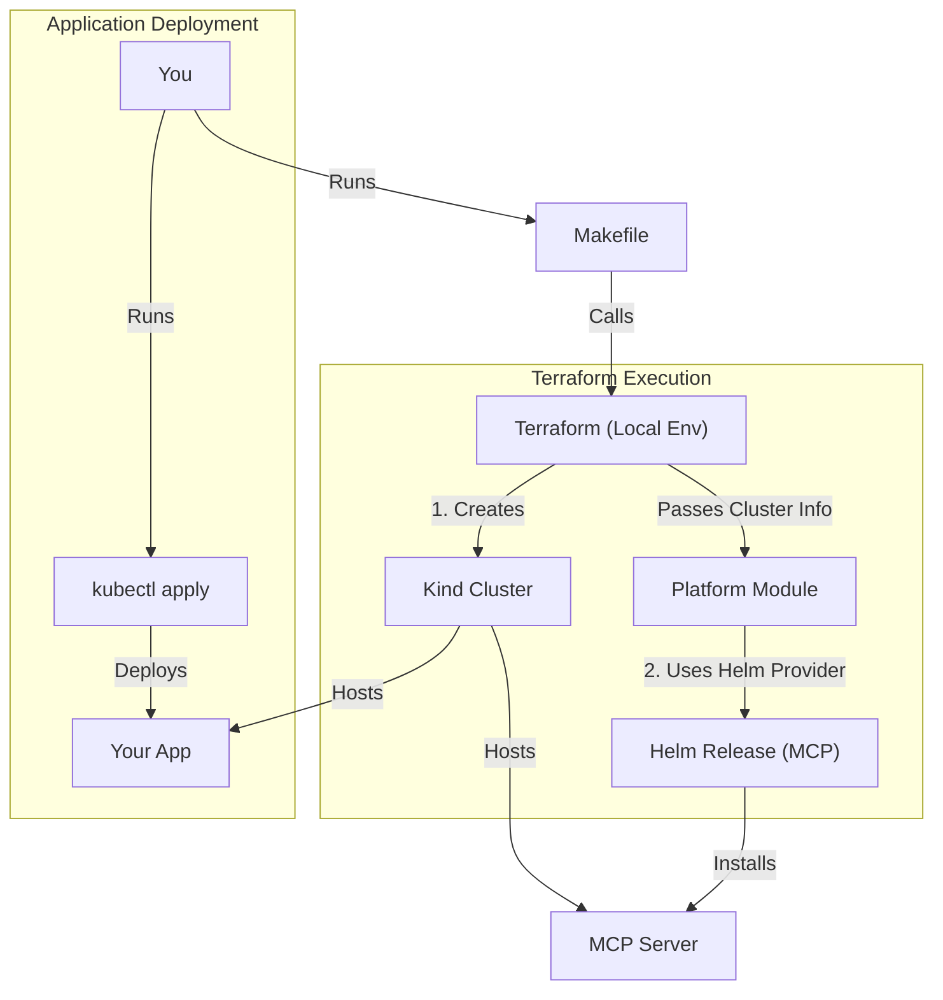

# Learning Helm4GenAI

Welcome! If you are new to Terraform, Kubernetes, and Helm, this guide is for you. We will explain how this project works from the ground up, using simple analogies.

## 1. The Big Picture

Imagine you want to build a **City** (Kubernetes Cluster) where various **Businesses** (Applications) can operate.

- You need a **Contractor** (Terraform) to build the city infrastructure (roads, utilities).
- You need an **Appliance Installer** (Helm) to install complex machinery (like power plants or large factories) that businesses need.
- You need an **Appliance Installer** (Helm) to install complex machines (like the AI model server) that your business needs.
- You operate your **Business** (Application) using standard forms (Kubernetes Deployment/Service).

In this project:
1.  **Terraform** acts as the Contractor. It talks to your computer to create a "Kind" cluster (a mini-city on your laptop).
2.  **Terraform** also hires the **Appliance Installer (Helm)** to install the GenAI Platform stack (like vLLM and MCP).
3.  **You** use standard Kubernetes manifests (`deployment.yaml`, `service.yaml`) to run your app.

## 2. The Tools

### [Kubernetes (K8s)](https://kubernetes.io/docs/home/) - *The City*
Kubernetes is a system for running software in "containers" (standardized packages). It handles keeping them running, connecting them to the network, and scaling them. It's complex, like managing a real city.
- **Learn More**: [Kubernetes Basics Modules](https://kubernetes.io/docs/tutorials/kubernetes-basics/)

### [Terraform](https://developer.hashicorp.com/terraform/intro) - *The Contractor*
Terraform allows you to define "Infrastructure as Code". Instead of manually clicking buttons or running commands to create a server, you write a file that says "I want one server", and Terraform makes it happen.
- **Learn More**: [Terraform Core Concepts](https://developer.hashicorp.com/terraform/tutorials/aws-get-started/infrastructure-as-code)

### [Helm](https://helm.sh/docs/) - *The Package Manager*
Kubernetes applications are made of many files (deployments, services, configs). Helm packages them all into one "Chart" so you can install a complex app with one command.
- **Learn More**: [Helm Quickstart](https://helm.sh/docs/intro/quickstart/)


### [Kind](https://kind.sigs.k8s.io/) - *The Simulator*
Kind (Kubernetes IN Docker) is a tool for running local Kubernetes clusters using Docker container "nodes". It's perfect for testing and learning.

## 3. Deep Dive: Terraform Structure

We use a **Modular** structure to separate "Local Development" from "Production".

```
terraform/
├── environments/         # The places where we deploy
│   ├── local/            # Your laptop (using Kind)
│   │   ├── main.tf
│   │   └── versions.tf
│   └── prod/             # The real world (AWS/GCP/Azure)
│       ├── main.tf
│       └── versions.tf
└── modules/              # Reusable blueprints
    └── platform/         # Logic shared by ALL environments
        ├── main.tf
        └── variables.tf
```

### Why this structure?
In a real company, you don't want to copy-paste code between Dev and Prod. You want them to be identical twins, except one is smaller.
- **Modules (`terraform/modules`)**: This is the "Blueprint". It says "Every city must have the GenAI Platform installed". It doesn't know *where* it's being built.
- **Environments (`terraform/environments`)**: This is the "Site Plan". 
    - `local/main.tf` says: "Build the Blueprint on my laptop using Kind."
    - `prod/main.tf` says: "Build the Blueprint on AWS using 100 servers."

### The Files Explained

#### `environments/local/main.tf`
This is the entry point for your local setup.
1.  **Provider Setup**: Configuring `kind` to run locally.
2.  **Resource `kind_cluster`**: Tells Terraform to actually spin up the Docker containers.
3.  **Module Call**:
    ```hcl
    module "platform" {
      source = "../../modules/platform"
      depends_on = [kind_cluster.default]
    }
    ```
    This line is magic. It says "Go look at the `platform` folder and do whatever is written there."

#### `modules/platform/main.tf`
This contains the `helm_release` resources for the platform (like MCP). Because it's in a module, we can reuse it. If we add "Prometheus" (monitoring) to this file later, BOTH Local and Prod get it automatically!

### Why Terraform instead of just Helm YAMLs?

You could theoretically run `kind create cluster` manually, and then `helm install kubevela ...` manually. But using Terraform gives us **State** and **Unity**:

-   **Single Source of Truth**: The `main.tf` files define the *entire* state.
-   **Dependency Management**: Terraform knows it MUST build the cluster before it tries to install Helm charts.
-   **Lifecycle**: `terraform destroy` wipes everything clean in the correct reverse order.

## 4. How It All Connects



By wrapping the infrastructure complexity in Terraform but keeping application deployment standard, you get a robust environment while learning the industry-standard way to deploy apps.

## 5. Deep Dive: Configuration Explained

This section details the specific choices we made in the Terraform and Helm configurations, so you can do it yourself in the future.

### The "Load Local Images" Trick (`environments/local/main.tf`)
In `environments/local/main.tf`, you'll see a weird block called `null_resource "load_images"`.

**The Problem**:
When you run `helm install`, Kubernetes tries to download the Docker images from the internet. If your internet is slow, or if you are running this 50 times a day, it wastes time and bandwidth.

**The Solution**:
We use a trick to "preload" the images into the Kind cluster from your local machine.

```hcl
provisioner "local-exec" {
  command = <<EOT
    podman save -o /tmp/image.tar my-image:latest
    kind load image-archive /tmp/image.tar --name helm4genai-cluster
  EOT
}
```
1.  `podman save`: Takes the image you already built locally and wraps it in a `.tar` file.
2.  `kind load`: Throws that `.tar` file directly into the Kind cluster node.
Now, when Kubernetes asks for `my-image:latest`, Kind says "I already have that!" and skips the download.

### Helm Configuration Choices (`modules/platform/main.tf`)

#### 1. Local Path for MCP
For **MCP**, we point to a folder on your disk:
```hcl
chart = "${path.module}/charts/mcp"
```
This is like installing software you wrote yourself. `${path.module}` is Terraform's way of saying "the folder where this file lives".

#### 2. Passing Values (`yamlencode`)
Helm charts are configured using YAML values (like `values.yaml`). Terraform creates these values dynamically.
```hcl
values = [
  yamlencode({
    clickhouse = {
      replicaCount = var.clickhouse_replica_count
    }
  })
]
```
-   **Why `yamlencode`?**: It safely converts Terraform variables (numbers, strings) into valid YAML format for Helm. It prevents syntax errors you'd get if you tried to format the string manually.

#### 3. `wait = false`
You might see `wait = false` on some releases.
-   `wait = true` (Default): Terraform waits until every Pod is Green and Happy before finishing. Good for production.
-   `wait = false`: Terraform submits the request to Kubernetes and immediately says "Done!".
**Why we use false?** For large downloads (like AI models), `wait = true` might time out after 5 minutes, causing Terraform to "fail" even though the download is just slow. We assume it will eventually finish.

### Application Configuration (`modules/platform/vllm.tf`)

#### 1. Why `kubernetes_deployment` instead of Helm?
For **vLLM**, we didn't use a Helm chart. We defined a `kubernetes_deployment` directly in Terraform.
**Why?** Sometimes finding a good, official Helm chart is hard. If you just need one Deployment and one Service, writing it directly in Terraform (HCL) is often simpler than creating a whole new Helm chart just for one file.

#### 2. The Move to Ollama (Local AI)
Instead of trying to run a heavy Python-based vLLM container on your Mac (which is hard and slow), we now use **Ollama**.

In `environments/local/main.tf`, we override the defaults to use Ollama:
```hcl
vllm_image = "ollama/ollama:latest"
vllm_args  = ["serve"]
vllm_env   = { OLLAMA_HOST = "0.0.0.0:8000" }
```
This is a great example of **reusability**:
-   The `modules/platform/vllm.tf` file is generic. It just says "Run an image with these arguments".
-   The `environments/local/main.tf` says "Use Ollama".
-   A future `environments/prod/main.tf` could say "Use real vLLM with Nvidia GPUs".

**Why Ollama?** It's optimized for running LLMs on consumer hardware (Mac M1/M2/M3). It mimics the OpenAI API, so our apps don't know the difference!

**Where is the Model?**
You might notice Terraform doesn't ask for `tinyllama` or `llama3`. That's intentional!
Terraform provides the *infrastructure* (the Ollama server).
The `Makefile` (or the App) provides the *content* (pulling the specific model).
This separation means you can switch models without redeploying the cluster.

**Note on Image Preloading**: We generally pull `ollama/ollama:latest` normally, or pre-load it if we want to save bandwidth. The `wait_for_rollout = false` is still useful because Ollama takes a few seconds to wake up.

#### 3. `wait_for_rollout = false`
You will see this line in the vLLM deployment:
```hcl
wait_for_rollout = false
```
**Why?** Since we are using local images that might be loaded *after* Terraform runs (or in parallel), we don't want Terraform to crash if the Pod doesn't start immediately. We tell Terraform "Just create the rule, don't wait for the Pod to be green." This prevents Terraform from timing out during local development.

### Dynamic Toggles (`count`)
We want to be able to turn off the AI stuff if we just want a minimal cluster.
```hcl
resource "helm_release" "mcp" {
  count = var.genai_enabled ? 1 : 0
  ...
}
```
**Translation**:
-   "If `genai_enabled` is true, create **1** copy of this."
-   "If `genai_enabled` is false, create **0** copies." (Terraform deletes it if it existed).

## 6. Extensive Learning Resources

- **Project Structure Best Practices**:
    - [Standard Module Structure](https://developer.hashicorp.com/terraform/language/modules/develop/structure)
    - [Terraform Best Practices](https://www.terraform-best-practices.com/)
- **Terraform**:
    - [Official Tutorials](https://developer.hashicorp.com/terraform/tutorials)
    - [Terraform Up & Running (Book)](https://www.oreilly.com/library/view/terraform-up-and/9781098116736/)
- **Kubernetes**:
    - [Kubernetes.io Documentation](https://kubernetes.io/docs/home/)
    - [Illustrated Children's Guide to Kubernetes](https://www.cncf.io/phippy-goes-to-the-zoo/the-illustrated-childrens-guide-to-kubernetes/) (Great for concepts!)
- **Helm**:
    - [The Helm Docs](https://helm.sh/docs/)

