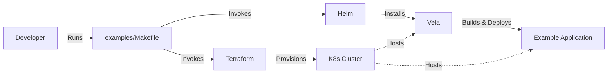

# Helm4GenAI

The purpose of this project is to create Helm configuration that can be used to deploy a GenAI application.

## Local System Assumptions

- MacOS
- Podman

## Version 0.0.1: Boilerplate

- Terraform to spin up a K8s cluster.
- Helm configuration to have Vela instance running on k8s cluster.
- Follow best practices for Helm charts, directory structure, and file structure for this type of project.
- Examples at `examples/` directory.
    - `examples/Makefile` with a recipe for spinning up a k8s cluster and deploying the examples.
    - `examples/minimal/` directory with a minimal example of an application (not GenAI-related) to be built via vela.

- Expected flow:

- Split the project between dev (local) and prod (remote).

    - I am not sure what is the standard and best-practices way of doing it. You will need to figure it out.

- Include documentation in the `README.md` file as to how to use the Helm charts, including the mermaid diagram above.

- Make a second document `LEARNING.md` that will teach me in detail about this project. Assume I don't know anything about terraform, helm, kubernetes.

    - Make sure to explain in detail the structure of terraform files. Explain why this config file and not the helm yaml files.
    - Please, make sure the reader is provided with extensive extra material to go more in-depth if desired.

## Version 0.1.0: GenAI Application

- Add support for GenAI applications by including the following Helm charts:
    - vLLM
    - Langfuse
    - MCP

- Add a new example at `examples/robots/` directory, which leverages the Vela GenAI capabilities to build and deploy a GenAI application.
    - Features: vLLM model, simple agent interface based on gradio, integration to MCP and Langfuse.
    - The only purpose of this agent is to check a given URL and return the content of the `/robots.txt` file.
    - Make sure to check the prompt against a regex to ensure it is a valid URL.
    - The agent must be given internet access to fetch the content of the URL, via a MCP server with a `fetch_url_content` tool (curl-based).

- Include documentation at `examples/robots/README.md`.

- Review documentation at `README.md` for this new version of the code.
